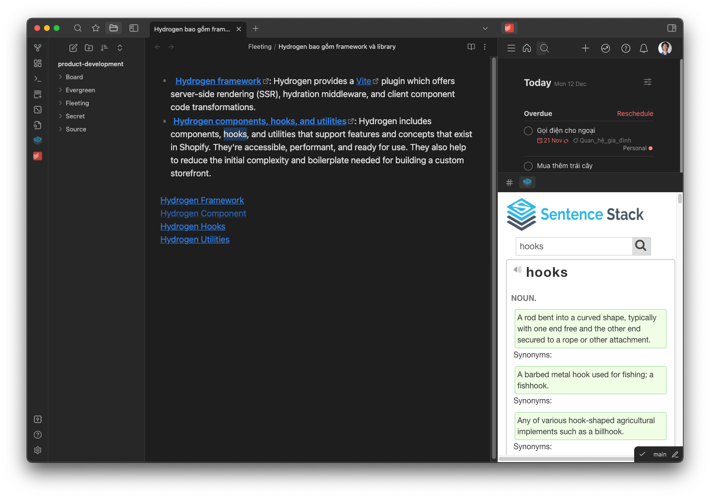

# Obsidian AI Assistant

A plugin for Obsidian that uses OpenAI's API to assist users in their note-taking and writing process.

## Features

- [x] File rename: Suggest a new name for the file based on its content.
- [ ] Text completion: Suggest text based on what the user has already written, making it easier to write and faster to complete thoughts.
- [ ] Text correction: The plugin can identify and suggest corrections for spelling, grammar, and style errors in real-time, making it easier to produce error-free writing.
- [ ] Question answering: Answer questions based on the text in the note, providing quick access to information without leaving Obsidian.

## Usage

### File rename

1. Right-click on a file in the file explorer and select "AI Rename".
2. The plugin will suggest a new name for the file based on its content.

### Text completion

TBD

### Text correction

TBD

### Question answering

TBD

## Requirements

- Obsidian v0.9.8 or later
- An OpenAI API key

## Support

For support, please open an issue on the GitHub repository or contact us via email.

## Contributing

Contributions are welcome! Please see the contribution guidelines for more information.

## License

The plugin is released under the MIT License.
